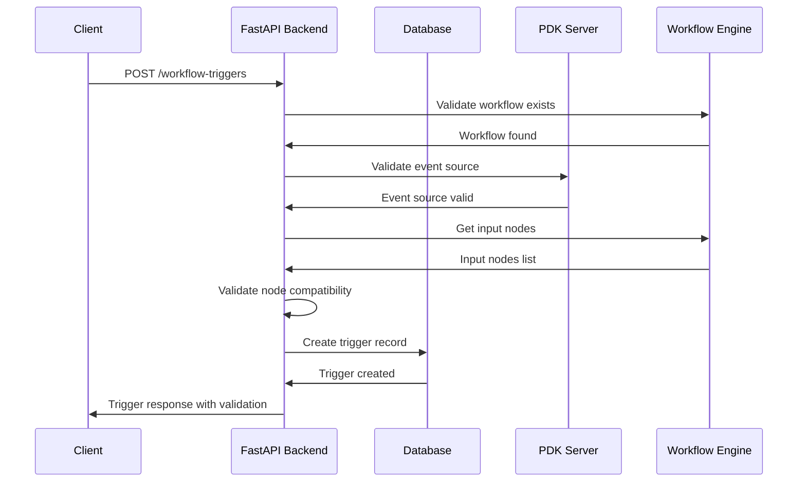
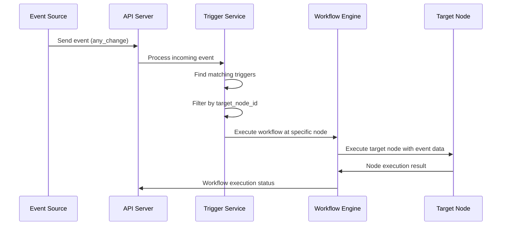

# API Documentation - Advanced Trigger System

## 📡 API Endpoints

### Workflow Input Nodes Discovery

#### `GET /api/workflows/{workflow_id}/input-nodes`

Recupera la lista dei nodi di input disponibili per un workflow specifico.

**Parametri:**
- `workflow_id` (path, required): ID del workflow

**Query Parameters:**
- `include_schemas` (boolean, optional): Include schemi nodi nella risposta (default: false)
- `validate_compatibility` (boolean, optional): Esegui validazione compatibilità (default: true)

**Response Example:**
```json
{
  "workflow_id": "workflow_123",
  "input_nodes": [
    {
      "node_id": "pdf_processor_node",
      "node_name": "PDF Document Processor",
      "node_type": "pdf-semantic-analyzer",
      "plugin_id": "pdf-semantic-complete-plugin",
      "description": "Analizza e processa documenti PDF",
      "inputs": [
        {
          "name": "file_path",
          "type": "string",
          "required": true,
          "description": "Percorso del file PDF da processare"
        },
        {
          "name": "file_name",
          "type": "string",
          "required": false,
          "description": "Nome del file"
        }
      ],
      "compatibility": {
        "pdf_file_added": "compatible",
        "pdf_file_modified": "compatible",
        "any_change": "compatible"
      }
    }
  ],
  "total_count": 1,
  "timestamp": "2025-08-05T10:30:00Z"
}
```

**Error Responses:**
```json
// 404 - Workflow non trovato
{
  "detail": "Workflow not found",
  "error_code": "WORKFLOW_NOT_FOUND",
  "workflow_id": "workflow_123"
}

// 500 - Errore nel caricamento del workflow
{
  "detail": "Error loading workflow structure",
  "error_code": "WORKFLOW_LOAD_ERROR",
  "internal_error": "Connection to PDK server failed"
}
```

### Enhanced Trigger Management

#### `POST /api/workflow-triggers`

Crea un nuovo trigger con supporto per nodo target specifico.

**Request Body:**
```json
{
  "name": "PDF Monitor Trigger",
  "description": "Monitora cartella PDF per nuovi documenti",
  "workflow_id": "workflow_123",
  "source": "pdf-monitor-event-source",
  "event_type": "any_change",
  "target_node_id": "pdf_processor_node",
  "config": {
    "monitor_path": "/path/to/pdf/folder",
    "recursive": true,
    "file_extensions": [".pdf"]
  },
  "is_active": true
}
```

**Response Example:**
```json
{
  "id": 456,
  "name": "PDF Monitor Trigger",
  "description": "Monitora cartella PDF per nuovi documenti",
  "workflow_id": "workflow_123",
  "source": "pdf-monitor-event-source",
  "event_type": "any_change",
  "target_node_id": "pdf_processor_node",
  "config": {
    "monitor_path": "/path/to/pdf/folder",
    "recursive": true,
    "file_extensions": [".pdf"]
  },
  "is_active": true,
  "created_at": "2025-08-05T10:30:00Z",
  "updated_at": "2025-08-05T10:30:00Z",
  "validation": {
    "node_compatibility": "valid",
    "schema_match": "compatible",
    "warnings": []
  }
}
```

#### `PUT /api/workflow-triggers/{trigger_id}`

Aggiorna un trigger esistente con supporto per modifica nodo target.

**Request Body:**
```json
{
  "name": "PDF Monitor Trigger Updated",
  "target_node_id": "advanced_pdf_processor_node",
  "config": {
    "monitor_path": "/new/path/to/pdf/folder",
    "max_file_size": 50
  }
}
```

**Response:** Same structure as POST response

#### `GET /api/workflow-triggers/{trigger_id}/validation`

Valida la compatibilità di un trigger con il suo nodo target.

**Response Example:**
```json
{
  "trigger_id": 456,
  "validation_result": {
    "is_valid": true,
    "compatibility_score": 0.95,
    "checks": [
      {
        "check": "node_exists",
        "status": "pass",
        "message": "Target node exists in workflow"
      },
      {
        "check": "schema_compatibility",
        "status": "pass",
        "message": "Event schema compatible with node inputs"
      },
      {
        "check": "plugin_availability",
        "status": "pass",
        "message": "Required plugin is loaded and available"
      }
    ],
    "warnings": [],
    "errors": []
  },
  "recommendations": [
    "Consider adding file size validation in trigger config"
  ]
}
```

### Event Sources Integration

#### `GET /api/event-sources/{source_id}/events`

Recupera gli eventi disponibili per una specifica event source (PDK integration).

**Query Parameters:**
- `t` (timestamp): Cache busting parameter
- `include_schemas` (boolean): Include schemi degli eventi

**Response Example:**
```json
{
  "source_id": "pdf-monitor-event-source",
  "eventTypes": [
    {
      "id": "pdf_file_added",
      "name": "PDF File Added",
      "description": "Triggered when a new PDF file is added to the monitored folder",
      "tags": ["file-added", "new-document", "ingest"],
      "outputs": [
        {
          "name": "file_path",
          "type": "string",
          "description": "Absolute path to the new PDF file"
        },
        {
          "name": "file_name", 
          "type": "string",
          "description": "Name of the PDF file"
        },
        {
          "name": "file_size",
          "type": "number", 
          "description": "Size of the file in bytes"
        }
      ]
    },
    {
      "id": "any_change",
      "name": "Qualsiasi Modifica",
      "description": "Triggered when any change occurs in the monitored folder",
      "tags": ["any-change", "comprehensive-monitoring"],
      "outputs": [
        {
          "name": "file_path",
          "type": "string",
          "description": "Absolute path to the changed PDF file"
        },
        {
          "name": "change_type",
          "type": "string", 
          "description": "Type of change: created, modified, or deleted",
          "enum": ["created", "modified", "deleted"]
        },
        {
          "name": "detected_at",
          "type": "string",
          "description": "ISO timestamp when the change was detected"
        }
      ]
    }
  ]
}
```

## 🔄 Data Flow

### Trigger Creation Flow


### Event Processing Flow


## 🛡️ Error Handling

### Common Error Codes

| Code | Description | Resolution |
|------|-------------|------------|
| `WORKFLOW_NOT_FOUND` | Workflow ID non esistente | Verificare ID workflow |
| `NODE_NOT_FOUND` | Nodo target non trovato | Verificare ID nodo nel workflow |
| `SCHEMA_INCOMPATIBLE` | Schemi evento/nodo incompatibili | Verificare compatibilità tipi |
| `EVENT_SOURCE_UNAVAILABLE` | Event source non disponibile | Verificare PDK server |
| `VALIDATION_FAILED` | Validazione trigger fallita | Controllare configurazione |

### Error Response Format
```json
{
  "detail": "Human readable error message",
  "error_code": "MACHINE_READABLE_CODE",
  "context": {
    "workflow_id": "workflow_123",
    "node_id": "problematic_node",
    "validation_errors": ["Specific validation issue"]
  },
  "timestamp": "2025-08-05T10:30:00Z",
  "request_id": "req_abc123"
}
```

## 🔐 Authentication & Authorization

### Required Permissions

| Endpoint | Permission | Description |
|----------|------------|-------------|
| `GET /workflows/{id}/input-nodes` | `workflow:read` | Lettura struttura workflow |
| `POST /workflow-triggers` | `trigger:create` | Creazione trigger |
| `PUT /workflow-triggers/{id}` | `trigger:edit` | Modifica trigger |
| `DELETE /workflow-triggers/{id}` | `trigger:delete` | Eliminazione trigger |
| `GET /workflow-triggers/{id}/validation` | `trigger:read` | Validazione trigger |

### Rate Limiting

| Endpoint | Rate Limit | Window |
|----------|------------|---------|
| Input nodes discovery | 30 req/min | Per utente |
| Trigger operations | 60 req/min | Per utente |
| Event source queries | 120 req/min | Per utente |

## 📈 Performance Metrics

### Response Time Targets
- Input nodes discovery: < 200ms
- Trigger creation: < 500ms
- Trigger validation: < 100ms
- Event processing: < 50ms

### Monitoring Endpoints
```
GET /api/health/triggers - Trigger system health
GET /api/metrics/triggers - Trigger performance metrics
GET /api/metrics/event-processing - Event processing statistics
```

---

**Versione API:** v1.0.0
**Documentazione generata:** 2025-08-05
**Base URL:** `http://localhost:8000/api`
