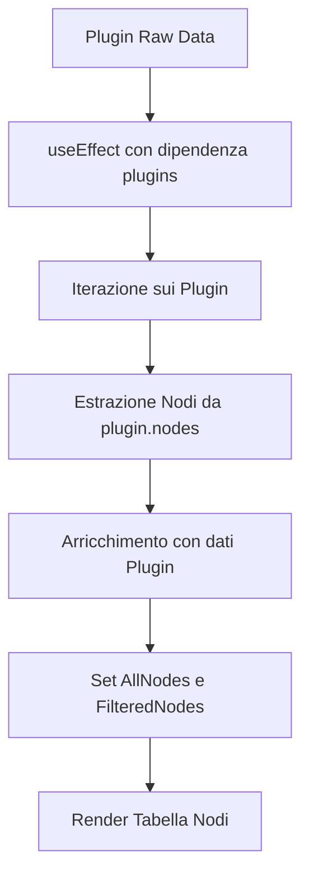

# Sistema di Visualizzazione dei Nodi PDK

## Panoramica
Il sistema di visualizzazione dei nodi PDK è stato completamente riprogettato per mostrare i singoli nodi utilizzabili invece dei contenitori di plugin. Questa implementazione migliora significativamente l'esperienza utente permettendo l'accesso diretto ai componenti che vengono effettivamente utilizzati nel canvas di workflow.

## Architettura Implementata

### Componenti Principali

#### PDKPluginList.jsx
**Funzione**: Componente principale per la visualizzazione dei nodi PDK disponibili
**Localizzazione**: `PramaIAServer/frontend/client/src/components/PDKPluginList.jsx`

**Funzionalità Chiave**:
- Estrazione automatica dei nodi dai plugin container
- Visualizzazione tabellare con informazioni complete sui nodi
- Integrazione con sistema di tag e filtri
- Gestione dell'apertura del modal di dettagli

**Struttura Dati dei Nodi**:
```javascript
{
  ...node,                    // Proprietà originali del nodo
  pluginId: plugin.id,        // ID del plugin contenitore
  pluginName: plugin.name,    // Nome del plugin per riferimento
  pluginTags: plugin.tags,    // Tag del plugin ereditate
  plugin: plugin             // Riferimento completo al plugin
}
```

#### NodeDetailsModal.jsx
**Funzione**: Modal avanzato per visualizzazione e gestione dettagli nodi
**Localizzazione**: `PramaIAServer/frontend/client/src/components/NodeDetailsModal.jsx`

**Caratteristiche**:
- Interfaccia a tab: Info, Category, Schema, Plugin, Debug
- Gestione delle categorie dei nodi con override
- Visualizzazione completa dello schema del nodo
- Informazioni dettagliate sul plugin contenitore
- Panel di debug per sviluppatori

### Flusso di Estrazione dei Nodi



## Implementazione Tecnica

### Hook usePDKPlugins
Fornisce i dati dei plugin filtrati escludendo automaticamente gli event sources:
- Filtraggio lato server per type !== "event-source"
- Gestione stato di caricamento e errori
- Funzioni per aggiornamento e reset filtri

### Sistema di Filtraggio
**PDKTagManagementPanel**: Componente riutilizzabile per filtri avanzati
- Filtri per tag combinati (nodo + plugin)
- Statistiche in tempo reale
- Tag cloud interattiva

### Gestione degli Eventi

#### Apertura Modal Dettagli
```javascript
const handleNodeDetails = (node) => {
  setSelectedNode(node);
  setShowNodeModal(true);
};
```

#### Chiusura Automatica Modal
```javascript
useEffect(() => {
  if (!selectedNode && showNodeModal) {
    setShowNodeModal(false);
  }
}, [selectedNode, showNodeModal]);
```

## Interfaccia Utente

### Tabella Nodi
Colonne implementate:
1. **Nome Nodo**: Icon + nome del nodo
2. **Plugin**: Nome del plugin contenitore
3. **Descrizione**: Descrizione troncata con tooltip
4. **Categoria**: Badge colorato per la categoria
5. **Tags**: Badge per tag (massimo 3 visibili + contatore)
6. **Azioni**: Bottone "Dettagli" per apertura modal

### Stati dell'Interfaccia
- **Loading**: Spinner di caricamento
- **Error**: Messaggio di errore con styling appropriato
- **Empty State**: Messaggio quando nessun nodo corrisponde ai filtri
- **No Results**: Interfaccia quando i filtri non restituiscono risultati

## Vantaggi dell'Implementazione

### Per l'Utente
1. **Visibilità Diretta**: I nodi utilizzabili sono immediatamente visibili
2. **Contesto Completo**: Informazioni sul plugin di origine mantenute
3. **Ricerca Efficace**: Filtri per tag combinati (nodo + plugin)
4. **Accesso Rapido**: Click diretto su "Dettagli" per configurazione

### Per lo Sviluppo
1. **Manutenibilità**: Separazione chiara tra logica di estrazione e visualizzazione
2. **Estensibilità**: Facile aggiunta di nuove colonne o filtri
3. **Performance**: Estrazione una tantum con caching locale
4. **Debug**: Panel di debug integrato nel modal

## Integrazione con Sistemi Esistenti

### Sistema di Categorie
- Supporto per categorie personalizzate via NODE_CATEGORIES
- Override delle categorie a livello di nodo
- Fallback automatico a categoria "General"

### Sistema di Tag
- Combinazione automatica di tag del nodo e del plugin
- Filtraggio avanzato con operatori logici
- Statistiche in tempo reale

### Event Sources
- Esclusione automatica dalla lista nodi
- Gestione separata nel sistema di event monitoring
- Filtraggio lato server e client

## Configurazione e Personalizzazione

### Aggiunta di Nuove Colonne
Per aggiungere una nuova colonna alla tabella:

1. Aggiornare l'header della tabella
2. Aggiungere la cella corrispondente nel map dei nodi
3. Eventualmente aggiornare la logica di estrazione se necessario

### Personalizzazione del Modal
Il NodeDetailsModal può essere esteso con nuove tab modificando:
- L'array delle tab disponibili
- I componenti di rendering per ogni tab
- La logica di validazione se necessario

## Considerazioni Future

### Performance
- Implementazione di virtualizzazione per grandi quantità di nodi
- Lazy loading delle informazioni dettagliate
- Caching intelligente dei dati di plugin

### Funzionalità
- Drag & drop diretto dalla tabella al canvas
- Preview live dello schema del nodo
- Sistema di favoriti per nodi frequentemente utilizzati

### Monitoraggio
- Metriche sull'utilizzo dei nodi
- Analytics sui filtri più utilizzati
- Feedback sull'efficacia dell'interfaccia

## Riferimenti Tecnici

### File Correlati
- `usePDKData.js`: Hook per gestione dati PDK
- `PDKTagManagement.jsx`: Componenti per gestione tag
- `nodeCategories.js`: Utilities per categorie
- `plugin-api-server.js`: API server per dati plugin

### API Endpoints
- `GET /api/plugins`: Lista plugin con filtraggio
- `GET /api/plugins/:id`: Dettagli plugin specifico
- `GET /api/event-sources`: Event sources separati

## Data di Implementazione
**Agosto 2025** - Refactoring completo da visualizzazione plugin a visualizzazione nodi

## Note di Sviluppo
Questa implementazione rappresenta un cambio paradigmatico significativo nell'interfaccia PDK, spostando il focus dai contenitori di plugin ai componenti effettivamente utilizzabili. La decisione è stata guidata dal feedback degli utenti che necessitavano di accesso diretto ai nodi per il trascinamento nel canvas di workflow.
