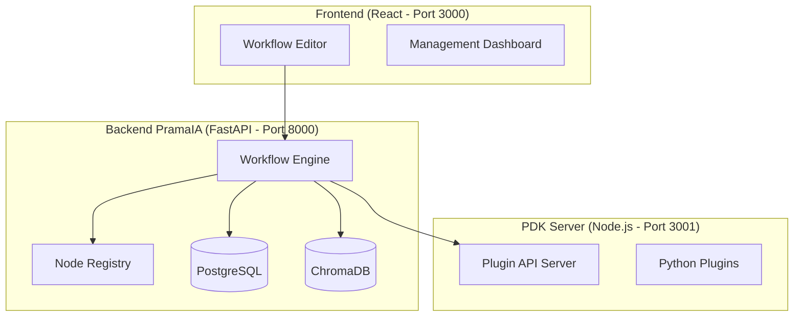
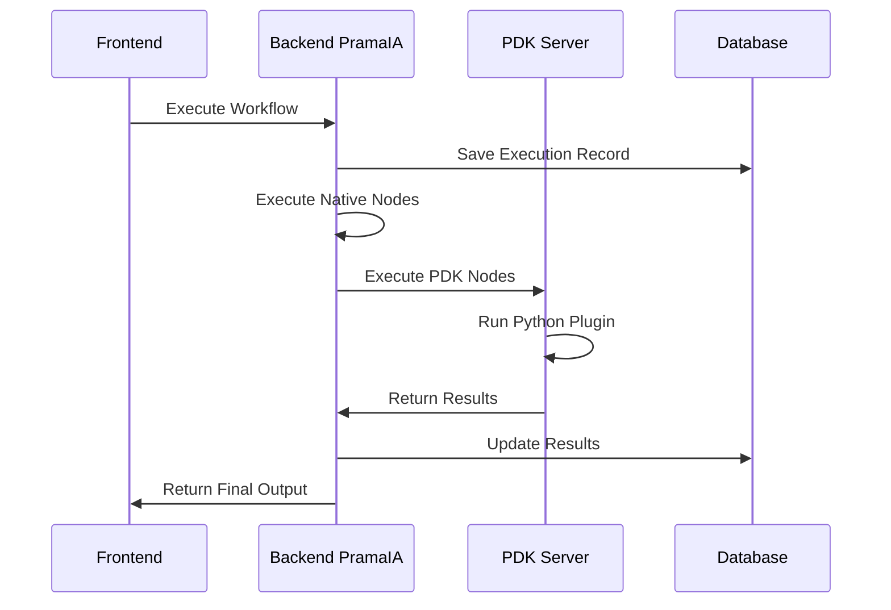

# 📚 Workflow PDF Semantic Processing Pipeline
## Documentazione Tecnica e Guida Utente

---

**Versione:** 1.0  
**Data:** 2 Agosto 2025  
**Sistema:** PramaIA - Plugin Development Kit  
**Autori:** Team PramaIA  

---

## 📋 Indice

1. [Panoramica Generale](#panoramica-generale)
2. [Architettura del Sistema](#architettura-del-sistema)
3. [Pipeline di Elaborazione](#pipeline-di-elaborazione)
4. [Tipi di Dati e Flusso](#tipi-di-dati-e-flusso)
5. [Configurazione Nodi](#configurazione-nodi)
6. [Esecuzione e Orchestrazione](#esecuzione-e-orchestrazione)
7. [Integrazione PDK](#integrazione-pdk)
8. [Monitoraggio e Debug](#monitoraggio-e-debug)
9. [Casi d'Uso](#casi-duso)
10. [Troubleshooting](#troubleshooting)

---

## 🎯 Panoramica Generale

Il **Workflow PDF Semantic Processing Pipeline** è un sistema avanzato di intelligenza artificiale per l'elaborazione semantica di documenti PDF. Implementa una pipeline completa che combina estrazione del testo, ricerca vettoriale e generazione di risposte tramite Large Language Models (LLM).

### Caratteristiche Principali

- **Elaborazione Intelligente**: Estrazione e chunking automatico del testo PDF
- **Ricerca Semantica**: Utilizzo di embeddings vettoriali per ricerca avanzata
- **RAG (Retrieval-Augmented Generation)**: Generazione di risposte contestualizzate
- **Architettura Modulare**: Nodi intercambiabili e configurabili
- **Scalabilità**: Supporto per documenti di grandi dimensioni
- **Integrazione PDK**: Estensibilità tramite plugin personalizzati

### Workflow ID
```
wf_pdf_semantic_[hash8caratteri]
```

---

## 🏛️ Architettura del Sistema

### Componenti Principali



### Server di Esecuzione

| Server | Responsabilità | Porta | Tecnologia |
|--------|---------------|-------|------------|
| **PramaIA Backend** | Orchestrazione workflow, nodi nativi | 8000 | FastAPI/Python |
| **PDK Server** | Esecuzione plugin personalizzati | 3001 | Node.js/Express |
| **Frontend** | Interfaccia utente, editor visuale | 3000 | React/ReactFlow |
| **ChromaDB** | Database vettoriale per embeddings | - | ChromaDB |

---

## 🔄 Pipeline di Elaborazione

Il workflow è composto da **due pipeline principali** che operano in sequenza:

### 📥 Pipeline 1: Ingestione PDF

Processa e indicizza i documenti PDF per renderli ricercabili semanticamente.

```
📄 PDF Input → 🔤 Text Extractor → ✂️ Text Chunker → 🧠 Text Embedder → 💾 ChromaDB Writer
```

#### Dettaglio Pipeline 1

1. **PDF Input** (`pdf_input_node`)
   - **Funzione**: Riceve file PDF dall'utente
   - **Output**: File binario + metadati
   - **Configurazione**: Limite 10MB, solo file PDF

2. **PDF Text Extractor** (`pdf_text_extractor`)
   - **Funzione**: Estrae testo dal PDF preservando il layout
   - **Tecnologia**: PyMuPDF o simili
   - **Output**: Testo completo + metadati di estrazione

3. **Text Chunker** (`text_chunker`) 
   - **Funzione**: Divide il testo in segmenti ottimali per l'embedding
   - **Configurazione**: 1000 caratteri per chunk, 200 di overlap
   - **Output**: Array di chunks con posizioni e overlap

4. **Text Embedder** (`text_embedder`)
   - **Funzione**: Genera rappresentazioni vettoriali del testo
   - **Modello**: `sentence-transformers/all-MiniLM-L6-v2` (384 dimensioni)
   - **Output**: Vettori embedding per ogni chunk

5. **ChromaDB Writer** (`chroma_vector_store`)
   - **Funzione**: Salva embeddings nel database vettoriale
   - **Persistenza**: Directory locale `./chroma_db`
   - **Metrica**: Distanza coseno per similarità

### 🔍 Pipeline 2: Query e Risposta

Processa le domande dell'utente e genera risposte contestualizzate.

```
❓ Query Input → 🔍 ChromaDB Retriever → 🤖 LLM Processor → 📝 Output Formatter
                                     ↗
```

#### Dettaglio Pipeline 2

1. **Query Input** (`query_input_node`)
   - **Funzione**: Riceve domande dall'utente
   - **Validazione**: Massimo 500 caratteri, campo obbligatorio
   - **Output**: Query testuale + metadati temporali

2. **ChromaDB Retriever** (`chroma_retriever`)
   - **Funzione**: Ricerca semantica nei documenti indicizzati
   - **Configurazione**: Top-K=5, soglia similarità=0.7
   - **Output**: Documenti rilevanti ordinati per score

3. **LLM Processor** (`llm_processor`)
   - **Funzione**: Genera risposta usando il contesto recuperato
   - **Modello**: Ollama Llama 3.2 (locale)
   - **Configurazione**: Temperature=0.7, max_tokens=1000
   - **Prompt di Sistema**: Rispondere solo basandosi sui documenti forniti

4. **Output Formatter** (`pdf_results_formatter`)
   - **Funzione**: Formatta la risposta in formato leggibile
   - **Formato**: Markdown con metadati e fonti
   - **Output**: Documento finale con collegamenti alle fonti

---

## 📊 Tipi di Dati e Flusso

### Sistema di Tipizzazione

PramaIA utilizza un sistema di tipizzazione forte con validazione e conversione automatica:

```python
class DataType(Enum):
    STRING = "string"      # Testo semplice
    NUMBER = "number"      # Numeri (int/float)
    BOOLEAN = "boolean"    # True/False
    FILE = "file"          # File binari/path
    JSON = "json"          # Oggetti strutturati
    ARRAY = "array"        # Liste
    OBJECT = "object"      # Dizionari Python
    EMAIL = "email"        # Email validate
    URL = "url"            # URL validate
    ANY = "any"            # Qualsiasi tipo
```

### Flusso Dati Dettagliato

#### 1. PDF Input → Text Extractor

**Tipo**: `FILE` → `STRING`

```json
{
  "data_type": "FILE",
  "content": "<binary_pdf_data>",
  "metadata": {
    "filename": "document.pdf",
    "size": 2048576,
    "mime_type": "application/pdf",
    "pages": 15
  }
}
```

#### 2. Text Extractor → Text Chunker

**Tipo**: `STRING` → `ARRAY`

```json
{
  "data_type": "STRING",
  "content": "Questo è il testo completo estratto dal PDF...",
  "metadata": {
    "total_chars": 15420,
    "total_words": 2890,
    "extraction_method": "pymupdf",
    "layout_preserved": true
  }
}
```

#### 3. Text Chunker → Text Embedder

**Tipo**: `ARRAY` → `OBJECT`

```json
{
  "data_type": "ARRAY",
  "chunks": [
    {
      "id": "chunk_0",
      "text": "Primo pezzo di testo con 1000 caratteri...",
      "start_char": 0,
      "end_char": 1000,
      "overlap_with_next": 200
    }
  ],
  "total_chunks": 16
}
```

#### 4. Text Embedder → ChromaDB Writer

**Tipo**: `OBJECT` → `OBJECT`

```json
{
  "data_type": "OBJECT",
  "embeddings": [
    {
      "chunk_id": "chunk_0",
      "vector": [0.1234, -0.5678, 0.9012, ...],
      "text": "Primo pezzo di testo...",
      "metadata": {
        "source": "document.pdf",
        "chunk_index": 0,
        "model": "sentence-transformers/all-MiniLM-L6-v2"
      }
    }
  ],
  "model_info": {
    "name": "sentence-transformers/all-MiniLM-L6-v2",
    "dimensions": 384,
    "max_sequence": 512
  }
}
```

#### 5. Query Input → ChromaDB Retriever

**Tipo**: `STRING` → `OBJECT`

```json
{
  "data_type": "STRING",
  "query": "Come funziona l'intelligenza artificiale?",
  "metadata": {
    "user_id": "user123",
    "timestamp": "2025-08-02T14:30:00Z",
    "language": "it"
  }
}
```

#### 6. ChromaDB Retriever → LLM Processor

**Tipo**: `OBJECT` → `OBJECT`

```json
{
  "data_type": "OBJECT",
  "retrieved_docs": [
    {
      "id": "chunk_5",
      "text": "L'intelligenza artificiale è un campo...",
      "score": 0.89,
      "metadata": {
        "source": "document.pdf",
        "page": 3,
        "chunk_index": 5
      }
    }
  ],
  "query": "Come funziona l'intelligenza artificiale?",
  "search_metadata": {
    "total_results": 5,
    "min_score": 0.75,
    "search_time_ms": 23
  }
}
```

#### 7. LLM Processor → Output Formatter

**Tipo**: `OBJECT` → `STRING`

```json
{
  "data_type": "OBJECT",
  "response": {
    "answer": "Basandomi sui documenti forniti, l'IA funziona attraverso...",
    "confidence": 0.92,
    "sources_used": ["chunk_5", "chunk_12", "chunk_3"],
    "model_info": {
      "model": "ollama/llama3.2",
      "temperature": 0.7,
      "tokens_used": 890,
      "tokens_max": 1000
    }
  },
  "context": {
    "query": "Come funziona l'intelligenza artificiale?",
    "retrieved_chunks": 5,
    "processing_time_ms": 1250
  }
}
```

### Validazione e Conversione Automatica

Il **WorkflowEngine** gestisce automaticamente:

- **Type Safety**: Validazione runtime con errori chiari
- **Auto-Conversion**: Conversioni intelligenti tra tipi compatibili
- **Rich Metadata**: Ogni dato porta informazioni contestuali
- **Debugging**: Log dettagliati delle conversioni

#### Matrice Compatibilità

| Da/A | STRING | NUMBER | JSON | ARRAY | FILE | ANY |
|------|--------|--------|------|-------|------|-----|
| STRING | ✅ | ⚠️ | ⚠️ | ⚠️ | ❌ | ✅ |
| NUMBER | ✅ | ✅ | ❌ | ❌ | ❌ | ✅ |
| JSON | ✅ | ❌ | ✅ | ⚠️ | ❌ | ✅ |
| ARRAY | ✅ | ❌ | ✅ | ✅ | ❌ | ✅ |
| FILE | ⚠️ | ❌ | ❌ | ❌ | ✅ | ✅ |
| ANY | ✅ | ✅ | ✅ | ✅ | ✅ | ✅ |

**Legenda**: ✅ Compatibile, ⚠️ Conversione con warning, ❌ Incompatibile

---

## ⚙️ Configurazione Nodi

### Nodi di Input

#### PDF Input Node
```json
{
  "accept_multiple": false,
  "max_file_size": "10MB",
  "allowed_types": ["pdf"]
}
```

#### Query Input Node
```json
{
  "input_type": "text",
  "max_length": 500,
  "required": true
}
```

### Nodi di Processing

#### PDF Text Extractor
```json
{
  "preserve_layout": true,
  "extract_images": false,
  "chunk_overlap": 200
}
```

#### Text Chunker
```json
{
  "chunk_size": 1000,
  "chunk_overlap": 200,
  "separator": "\n\n"
}
```

#### Text Embedder
```json
{
  "model": "sentence-transformers/all-MiniLM-L6-v2",
  "batch_size": 32,
  "normalize_embeddings": true
}
```

#### ChromaDB Writer
```json
{
  "collection_name": "pdf_documents",
  "persist_directory": "./chroma_db",
  "distance_metric": "cosine"
}
```

#### ChromaDB Retriever
```json
{
  "collection_name": "pdf_documents",
  "top_k": 5,
  "score_threshold": 0.7
}
```

#### LLM Processor
```json
{
  "model": "ollama/llama3.2",
  "temperature": 0.7,
  "max_tokens": 1000,
  "system_prompt": "Sei un assistente esperto. Rispondi alla domanda basandoti esclusivamente sul contesto fornito dai documenti PDF."
}
```

### Nodi di Output

#### Output Formatter
```json
{
  "output_format": "markdown",
  "include_sources": true,
  "include_metadata": true,
  "max_snippet_length": 200
}
```

---

## 🎬 Esecuzione e Orchestrazione

### Workflow Engine

Il **WorkflowEngine** è il componente centrale che orchestra l'esecuzione:

```python
class WorkflowEngine:
    async def execute_workflow(self, workflow, input_data, execution_id, db_session):
        # 1. Validazione workflow
        validation_result = await self._validate_workflow(workflow, input_data)
        
        # 2. Trova nodi di input
        input_nodes = self._find_input_nodes(workflow)
        
        # 3. Esegue nodi di input
        for input_node in input_nodes:
            await self._execute_node(input_node, context)
        
        # 4. Esegue il grafo del workflow
        await self._execute_workflow_graph(context)
        
        # 5. Raccoglie risultati finali
        results = self._collect_results(context)
```

### Stati di Esecuzione

| Stato | Descrizione | Azioni Disponibili |
|-------|-------------|-------------------|
| `RUNNING` | Workflow in esecuzione | Monitor, Cancel |
| `COMPLETED` | Esecuzione completata con successo | View Results, Re-run |
| `FAILED` | Esecuzione fallita | View Errors, Debug, Re-run |
| `CANCELLED` | Esecuzione annullata dall'utente | Re-run |

### Chi Esegue Cosa

#### Server PramaIA (Backend FastAPI)
- **Orchestrazione**: Coordina l'intero workflow
- **Nodi Nativi**: Tutti i nodi standard del sistema
- **Gestione Stato**: Database, contesto di esecuzione
- **Validazione**: Tipi di dati, connessioni

#### Server PDK (Node.js)
- **Plugin Python**: Esecuzione di nodi personalizzati
- **Isolamento**: Processi separati per plugin
- **API REST**: Endpoint per l'esecuzione remota



---

## 🔌 Integrazione PDK

### Plugin Development Kit

Il sistema PDK permette di estendere il workflow con nodi personalizzati:

#### Struttura Plugin
```
pdf-processing-plugin/
├── plugin.json          # Manifest del plugin
├── requirements.txt     # Dipendenze Python
└── src/
    └── plugin.py        # Implementazione nodi
```

#### Manifest Example
```json
{
  "name": "PDF Advanced Processor",
  "version": "1.0.0",
  "description": "Plugin avanzato per elaborazione PDF",
  "author": "Team PramaIA",
  "nodes": [
    {
      "id": "advanced_pdf_extractor",
      "name": "Advanced PDF Extractor",
      "description": "Estrazione avanzata con OCR",
      "type": "processing",
      "config_schema": {
        "enable_ocr": {"type": "boolean", "default": false},
        "language": {"type": "string", "default": "ita"}
      }
    }
  ]
}
```

#### Esecuzione Plugin
```python
# Plugin Python Implementation
async def process_node(node_id: str, inputs: dict, config: dict):
    if node_id == "advanced_pdf_extractor":
        # Implementazione personalizzata
        result = await extract_pdf_with_ocr(inputs["pdf_file"], config)
        return {"extracted_text": result}
```

### Registrazione Dinamica Nodi

Il sistema PDK registra automaticamente i nodi disponibili:

1. **Scoperta**: Scansione directory plugin
2. **Validazione**: Controllo manifest e dipendenze  
3. **Registrazione**: Aggiunta al Node Registry
4. **Frontend**: Aggiornamento palette nodi
5. **Esecuzione**: Routing verso server PDK

---

## 📊 Monitoraggio e Debug

### Logging Strutturato

Il sistema utilizza logging dettagliato per monitoraggio e debug:

```python
# Esempi di log durante l'esecuzione
logger.info(f"🚀 Avvio esecuzione workflow: {workflow.name}")
logger.info(f"📥 Trovati {len(input_nodes)} nodi di input")
logger.info(f"🔧 Eseguendo nodo '{node.name}' (tipo: {node.node_type})")
logger.info(f"🔄 Convertito input '{port_name}': {old_type} -> {new_type}")
logger.info(f"✅ Nodo '{node.name}' eseguito con successo")
logger.info(f"🎉 Workflow completato in {execution_time}ms")
```

### Metriche di Performance

| Metrica | Descrizione | Soglia Tipica |
|---------|-------------|---------------|
| **Execution Time** | Tempo totale di esecuzione | < 30s per PDF standard |
| **Memory Usage** | Memoria utilizzata durante l'elaborazione | < 2GB per documento 50MB |
| **Token Consumption** | Token LLM utilizzati | < 2000 per query complessa |
| **Embedding Time** | Tempo per generare embeddings | < 5s per 100 chunks |
| **Retrieval Time** | Tempo ricerca semantica | < 100ms per query |

### Dashboard di Monitoraggio

Il frontend fornisce una dashboard completa per monitorare:

- **Esecuzioni Recenti**: Ultimi 10 workflow eseguiti
- **Statistiche Performance**: Tempi medi, successi/fallimenti
- **Utilizzo Risorse**: CPU, memoria, storage
- **Errori e Warning**: Log degli ultimi problemi
- **Plugin Status**: Stato server PDK e plugin attivi

---

## 💼 Casi d'Uso

### 1. Sistema di Q&A Documentale

**Scenario**: Azienda con vasta documentazione tecnica
- **Input**: PDF manuali, procedure, policy
- **Processo**: Indicizzazione automatica documenti
- **Output**: Chatbot aziendale per supporto interno

**Benefici**:
- Ricerca istantanea in migliaia di documenti
- Risposte contestualizzate e citate
- Riduzione tempo ricerca informazioni del 80%

### 2. Analisi Contratti Legali

**Scenario**: Studio legale con centinaia di contratti
- **Input**: PDF contratti, accordi, clausole
- **Processo**: Estrazione e categorizzazione automatica
- **Output**: Sistema di ricerca semantica per clausole specifiche

**Benefici**:
- Identificazione rapida clausole simili
- Analisi comparativa automatica
- Riduzione tempo review contratti del 60%

### 3. Knowledge Base Scientifica

**Scenario**: Centro di ricerca con pubblicazioni scientifiche
- **Input**: PDF papers, articoli, report
- **Processo**: Estrazione concetti e relazioni
- **Output**: Sistema di raccomandazione ricerche correlate

**Benefici**:
- Scoperta connessioni tra ricerche
- Accelerazione processo di review letteratura
- Identificazione gap di ricerca

### 4. Supporto Tecnico Automatizzato

**Scenario**: Software house con documentazione prodotti
- **Input**: PDF guide utente, troubleshooting, FAQ
- **Processo**: Creazione base conoscenza tecnica
- **Output**: Assistente virtuale per supporto clienti

**Benefici**:
- Risposta automatica 70% delle richieste
- Escalation intelligente casi complessi
- Miglioramento customer satisfaction

---

## 🔧 Troubleshooting

### Problemi Comuni e Soluzioni

#### 1. Errore "Plugin non trovato"

**Sintomi**: 
```
❌ Errore: Plugin pdf-processor non disponibile
```

**Cause Possibili**:
- Server PDK non in esecuzione
- Plugin non installato correttamente
- Errori nel manifest plugin

**Soluzioni**:
```bash
# Verifica stato server PDK
curl http://localhost:3001/health

# Riavvia server PDK
cd PramaIA-PDK/server
npm start

# Verifica plugin installati
curl http://localhost:3001/api/plugins
```

#### 2. Errore di Conversione Tipo

**Sintomi**:
```
⚠️ Errore conversione input 'text_chunks': OBJECT -> ARRAY
```

**Cause**: Incompatibilità tipi tra nodi collegati

**Soluzioni**:
- Verificare schema input/output nodi
- Aggiungere nodo di conversione intermedio
- Modificare configurazione nodo per output corretto

#### 3. Timeout Esecuzione LLM

**Sintomi**:
```
❌ Timeout nella risposta del modello LLM
```

**Soluzioni**:
```json
{
  "max_tokens": 500,        // Ridurre token
  "temperature": 0.5,       // Ridurre creatività
  "timeout": 60            // Aumentare timeout
}
```

#### 4. ChromaDB Connection Error

**Sintomi**:
```
❌ Impossibile connettersi al database vettoriale
```

**Soluzioni**:
```bash
# Verifica directory esistente
ls -la ./chroma_db/

# Ricrea collection
rm -rf ./chroma_db/
# Il workflow ricreerà automaticamente
```

#### 5. Memoria Insufficiente

**Sintomi**:
```
❌ OutOfMemoryError durante embedding
```

**Soluzioni**:
```json
{
  "batch_size": 16,         // Ridurre da 32
  "chunk_size": 500,        // Ridurre dimensione chunks
  "max_file_size": "5MB"    // Limitare dimensione file
}
```

### Debug Avanzato

#### Abilitare Debug Logging

```python
# In settings.py
LOGGING = {
    'loggers': {
        'workflow_engine': {
            'level': 'DEBUG',
            'handlers': ['console', 'file']
        }
    }
}
```

#### Modalità Test

```python
# Esecuzione in modalità dry-run
result = await workflow_engine.validate_workflow(
    workflow=workflow,
    input_data=test_data,
    dry_run=True
)
```

#### Profiling Performance

```python
# Utilizzo profiler integrato
@profile_execution
async def execute_workflow(...):
    # Workflow execution
    pass
```

---

## 📈 Roadmap e Sviluppi Futuri

### Versione 1.1 (Q3 2025)
- [ ] Supporto file Word e PowerPoint
- [ ] Interfaccia web drag-and-drop per upload
- [ ] API REST pubbliche per integrazione esterna
- [ ] Dashboard analytics avanzate

### Versione 1.2 (Q4 2025)
- [ ] Supporto modelli LLM cloud (OpenAI, Anthropic)
- [ ] Caching intelligente risultati
- [ ] Workflow templates predefiniti
- [ ] Integrazione Active Directory

### Versione 2.0 (Q1 2026)
- [ ] Elaborazione video e audio
- [ ] Machine Learning per ottimizzazione automatica
- [ ] Deployment cloud-native (Kubernetes)
- [ ] Marketplace plugin community

---

## 📞 Supporto e Contributi

### Documentazione Aggiuntiva
- **API Reference**: `/docs` endpoint FastAPI
- **Plugin Development**: `PramaIA-PDK/README.md`
- **Deployment Guide**: `DEPLOYMENT.md`

### Community
- **GitHub Issues**: Report bug e feature request
- **Discord Server**: Supporto real-time sviluppatori
- **Wiki**: Esempi e tutorial community

### Licenza
Questo progetto è rilasciato sotto licenza MIT. Vedere `LICENSE` per dettagli completi.

---

**© 2025 PramaIA Team. Tutti i diritti riservati.**

*Documento generato automaticamente il 2 Agosto 2025*
