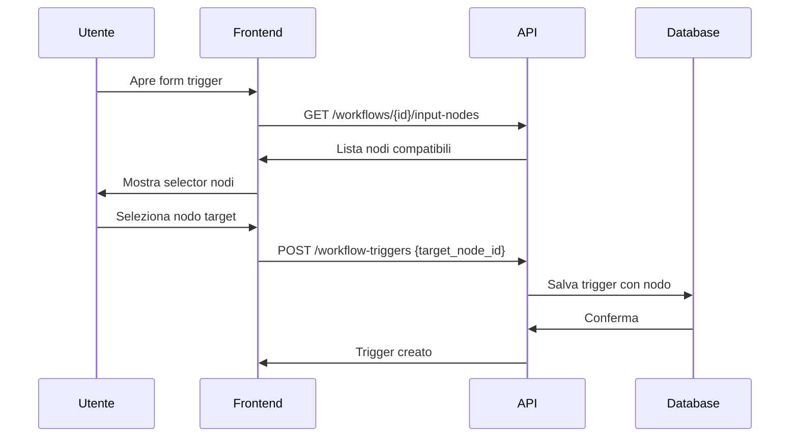
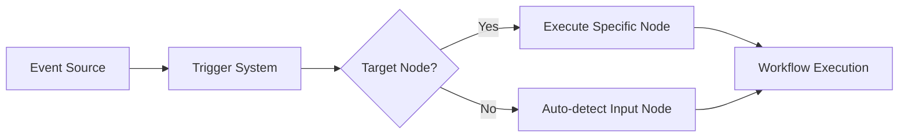

# Sistema Trigger Avanzato - Documentazione Tecnica

## 📋 Panoramica

Il sistema trigger avanzato di PramaIA implementa un routing intelligente tra event sources e nodi specifici del workflow, superando le limitazioni del sistema precedente che supportava solo un punto di ingresso per workflow.

## 🎯 Funzionalità Principali

### 1. **Selezione Intelligente Nodi di Input**
- Rilevamento automatico dei nodi compatibili con gli eventi
- Validazione schemi in tempo reale
- Selezione manuale del nodo target specifico

### 2. **Multi-Event Support**
- Supporto per eventi compositi (es. "any_change" per PDF monitor)
- Gestione di eventi multipli con metadata differenziati
- Compatibilità con schemi complessi

### 3. **Routing Trigger-to-Node**
- Mappatura diretta tra trigger e nodo specifico
- Eliminazione di ambiguità nei workflow multi-input
- Supporto per workflow complessi con multiple entry point

## 🏗️ Architettura

### Database Schema

```sql
-- Tabella workflow_triggers estesa
ALTER TABLE workflow_triggers 
ADD COLUMN target_node_id VARCHAR(255);

-- Indice per performance
CREATE INDEX idx_workflow_triggers_target_node 
ON workflow_triggers(target_node_id);
```

### Componenti Frontend

```
src/components/
├── InputNodeSelector.jsx     # Selezione intelligente nodi
└── workflow/
    └── TriggerFormModal.jsx  # Form trigger con selezione nodi
```

### API Endpoints

```
GET /api/workflows/{workflow_id}/input-nodes
POST /api/workflow-triggers                    # Con target_node_id
PUT /api/workflow-triggers/{trigger_id}       # Con target_node_id
```

## 🔧 Implementazione Tecnica

### Backend Components

#### 1. **Workflow Engine Enhancement**
```python
# backend/engine/workflow_engine.py
def _find_input_nodes(self, workflow_data):
    """
    Identifica automaticamente i nodi di input di un workflow
    - Cerca nodi senza connessioni in ingresso
    - Valida la compatibilità degli schemi
    - Filtra per nodi supportati dal registry
    """
```

#### 2. **Database Migration**
```python
# backend/db/migrations/add_target_node_to_triggers.py
def migrate():
    """Aggiunge campo target_node_id alla tabella workflow_triggers"""
```

#### 3. **Enhanced CRUD Operations**
```python
# backend/crud/workflow_triggers.py
def create_trigger(db: Session, trigger: WorkflowTriggerCreate):
    """Crea trigger con supporto per target_node_id"""

def update_trigger(db: Session, trigger_id: int, trigger_update: WorkflowTriggerUpdate):
    """Aggiorna trigger includendo target_node_id"""
```

### Frontend Components

#### 1. **InputNodeSelector Component**
```jsx
// frontend/client/src/components/InputNodeSelector.jsx
const InputNodeSelector = ({ workflowId, selectedNodeId, onNodeSelect }) => {
    // - Carica nodi di input disponibili
    // - Valida compatibilità
    // - Gestisce selezione utente
    // - Mostra informazioni debug
}
```

#### 2. **Enhanced TriggerFormModal**
```jsx
// frontend/client/src/components/workflow/TriggerFormModal.jsx
// - Integrazione con InputNodeSelector
// - Validazione real-time
// - Gestione errori migliorata
// - Debug logging
```

### PDK Integration

#### 1. **Enhanced PDF Monitor**
```json
// PramaIA-PDK/event-sources/pdf-monitor-event-source/plugin.json
{
  "eventTypes": [
    {
      "id": "any_change",
      "name": "Qualsiasi Modifica",
      "description": "Triggered when any change occurs in the monitored folder",
      "outputs": [
        {
          "name": "change_type",
          "type": "string",
          "enum": ["created", "modified", "deleted"]
        }
      ]
    }
  ]
}
```

#### 2. **Event Source Implementation**
```python
# PramaIA-PDK/event-sources/pdf-monitor-event-source/src/event_source.py
async def _process_file_event(self, event_type: str, file_path: str):
    """
    Emette sia eventi specifici che generici:
    - pdf_file_added/modified/deleted (eventi specifici)
    - any_change (evento generico con changeType)
    """
```

## 📊 Workflow di Utilizzo

### 1. **Creazione Trigger Standard**


### 2. **Execution Flow**


## 🧪 Testing

### Unit Tests
```python
# Test workflow engine
def test_find_input_nodes():
    """Testa rilevamento automatico nodi di input"""

def test_node_compatibility():
    """Testa validazione compatibilità schemi"""

# Test API endpoints
def test_get_workflow_input_nodes():
    """Testa endpoint discovery nodi"""

def test_create_trigger_with_node():
    """Testa creazione trigger con target_node_id"""
```

### Integration Tests
```javascript
// Test frontend components
describe('InputNodeSelector', () => {
  test('loads available nodes', async () => {
    // Testa caricamento nodi disponibili
  });

  test('validates node selection', () => {
    // Testa validazione selezione
  });
});
```

## 🐛 Debugging

### Logging Points
```python
# Backend logging
logger.info(f"[INPUT_NODES] Found {len(input_nodes)} input nodes for workflow {workflow_id}")
logger.debug(f"[INPUT_NODES] Node compatibility check: {node_id} vs {event_schema}")
```

```javascript
// Frontend logging
console.log('[InputNodeSelector] Available nodes:', availableNodes);
console.log('[useEventSources] Events for source:', eventTypes);
```

### Common Issues

1. **Nessun nodo trovato**
   - Verifica che il workflow abbia nodi senza connessioni in ingresso
   - Controlla che i nodi siano registrati nel schema registry

2. **Evento non caricato**
   - Verifica che il PDK server sia in esecuzione
   - Controlla i log di rete per errori API
   - Forza refresh cache con timestamp

3. **Validazione fallita**
   - Controlla compatibilità schemi tra evento e nodo
   - Verifica che il nodo supporti il tipo di input richiesto

## 🚀 Performance Considerations

### Database Optimization
```sql
-- Indici per performance
CREATE INDEX idx_workflow_triggers_workflow_id ON workflow_triggers(workflow_id);
CREATE INDEX idx_workflow_triggers_target_node ON workflow_triggers(target_node_id);
CREATE INDEX idx_workflow_triggers_composite ON workflow_triggers(workflow_id, target_node_id);
```

### Frontend Optimization
```javascript
// Caching dei nodi di input
const [nodeCache, setNodeCache] = useState(new Map());

// Debouncing delle validazioni
const debouncedValidation = useCallback(
  debounce((nodeId) => validateNodeCompatibility(nodeId), 300),
  []
);
```

## 🔮 Future Enhancements

### Planned Features
1. **Visual Flow Builder** - Drag & drop per connessioni trigger-nodo
2. **Advanced Routing Rules** - Regole condizionali per routing
3. **Multi-Node Triggers** - Trigger che attivano nodi multipli
4. **Event Transformation** - Trasformazione dati tra evento e nodo

### Scalability Improvements
1. **Event Source Registry** - Registry centralizzato per event sources
2. **Schema Versioning** - Gestione versioni schemi eventi
3. **Distributed Triggers** - Trigger distribuiti su cluster

## 📚 References

- [Workflow Engine Documentation](./WORKFLOW_ENGINE_DOCUMENTATION.md)
- [PDK Plugin Development Guide](../PramaIA-PDK/PramaIA-PDK-Guida-Integrazione.md)
- [Event Sources Documentation](../PramaIA-PDK/PDK-EVENT-SOURCES-DOCUMENTATION.md)
- [Database Schema Documentation](./DATABASE_SCHEMA_DOCUMENTATION.md)

---

**Versione:** 1.0.0
**Data:** 2025-08-05
**Autore:** PramaIA Development Team
