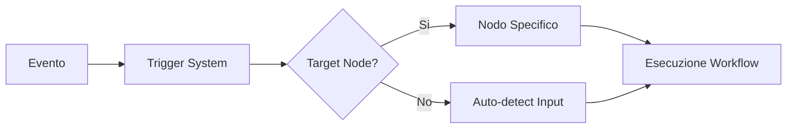

# 🔗 Input Nodes e Trigger System - Guida al Funzionamento

> **Documentazione**: Come il sistema PramaIA collega gli eventi ai nodi di workflow tramite il sistema di trigger  
> **Data**: Novembre 2025  
> **Versione**: 1.0

## 📋 Panoramica

Il **Trigger System** di PramaIA permette di collegare automaticamente **eventi esterni** (upload file, webhook, modifiche filesystem) a **specifici nodi di workflow**, creando un sistema di automazione reattivo e configurabile.

## 🔍 Scoperta Input Nodes

### Come Vengono Identificati i Nodi di Input

Il sistema identifica automaticamente i **nodi di input disponibili** in ogni workflow usando una logica semplice ma efficace:

```
🎯 LOGICA DI IDENTIFICAZIONE:
Un nodo è considerato "input node" se:
1. ✅ NON ha connessioni in ingresso (è un punto di partenza)
2. ✅ È presente nel workflow attivo
```

### API Endpoint

```http
GET /api/workflows/{workflow_id}/input-nodes
```

**Esempio Response:**
```json
{
  "workflow_id": "wf_055bf5029833",
  "workflow_name": "PDF Document UPDATE Pipeline", 
  "input_nodes": [
    {
      "node_id": "update_input_validator",
      "name": "Update Input Validator",
      "node_type": "UpdateInputValidator",
      "description": "Valida e processa input per aggiornamenti documento"
    }
  ]
}
```

## ⚙️ Configurazione Trigger

### Schema Database

I trigger sono configurati nella tabella `workflow_triggers`:

```sql
CREATE TABLE workflow_triggers (
    id INTEGER PRIMARY KEY,
    name TEXT NOT NULL,
    event_type TEXT NOT NULL,          -- Tipo evento (pdf_upload, file_added, etc.)
    workflow_id TEXT NOT NULL,         -- ID del workflow da eseguire
    target_node_id TEXT,               -- ID del nodo specifico (opzionale)
    active BOOLEAN DEFAULT 1,          -- Flag di attivazione
    conditions TEXT,                   -- Filtri JSON (opzionale)
    source TEXT,                       -- Sorgente evento (frontend, agent, etc.)
    created_at TIMESTAMP DEFAULT CURRENT_TIMESTAMP
);
```

### Configurazione via UI

1. **Selezione Workflow**: L'utente sceglie il workflow da attivare
2. **Scoperta Automatica**: Il frontend chiama l'API per ottenere i nodi di input disponibili
3. **Selezione Nodo Target**: L'utente sceglie quale nodo riceverà i dati dell'evento
4. **Configurazione Evento**: Definizione del tipo di evento che attiverà il trigger

## 🚀 Flusso di Esecuzione

### 1. Evento Scatenante



### 2. Risoluzione Input Node

**Con Target Node Specificato:**
```javascript
// Il trigger ha target_node_id configurato
trigger = {
  workflow_id: "wf_055bf5029833",
  target_node_id: "update_input_validator",
  event_type: "pdf_upload"
}
// → Invia dati direttamente al nodo specificato
```

**Auto-Discovery (Fallback):**
```javascript
// Se target_node_id è NULL o non valido
// → Sistema trova automaticamente il primo input node disponibile
inputNodes = await getWorkflowInputNodes(workflow_id);
targetNode = inputNodes[0].node_id;
```

### 3. Esempi Pratici

#### Upload PDF → Workflow UPDATE
```json
{
  "trigger_name": "PDF Upload Auto-Process",
  "event_type": "file_upload",
  "workflow_id": "wf_055bf5029833",
  "target_node_id": "update_input_validator",
  "conditions": {
    "file_type": "pdf",
    "size_min": 1000
  }
}
```

#### File Monitor → Workflow ADD
```json
{
  "trigger_name": "New PDF Detection", 
  "event_type": "pdf_file_added",
  "workflow_id": "pdf_document_add_workflow",
  "target_node_id": "pdf_input_processor",
  "source": "pdf-monitor-agent"
}
```

## 🎯 Tipi di Eventi Supportati

| **Evento** | **Sorgente** | **Uso Tipico** |
|------------|--------------|----------------|
| `file_upload` | Frontend | Upload manuale utenti |
| `pdf_file_added` | PDF Monitor Agent | Nuovi file rilevati |
| `pdf_file_modified` | PDF Monitor Agent | Modifiche a file esistenti |
| `webhook_received` | Webhook Handler | API esterne |
| `scheduled_trigger` | Scheduler | Esecuzioni programmate |
| `user_action` | Frontend | Azioni manuali specifiche |

## 🔧 Configurazione Avanzata

### Filtri Condizionali

```json
{
  "conditions": {
    "file_type": "pdf",
    "size_gt": 1000,
    "filename_pattern": "*.invoice.*",
    "metadata.priority": "high"
  }
}
```

### Mapping Dati Evento → Nodo

```javascript
// Dati dell'evento
eventData = {
  filename: "document.pdf",
  file_path: "/uploads/document.pdf",
  user_id: "user123",
  metadata: { source: "email", priority: "urgent" }
}

// Automaticamente mappati agli input del nodo target
nodeInputs = {
  file_path: eventData.file_path,
  filename: eventData.filename,
  user_context: { user_id: eventData.user_id },
  processing_options: eventData.metadata
}
```

## ⚠️ Troubleshooting

### Problemi Comuni

**"Nessun nodo di input disponibile"**
- ✅ **Verifica**: Il workflow ha nodi senza connessioni in ingresso?
- ✅ **Soluzione**: Assicurati che ci sia almeno un nodo "punto di partenza"

**"Target node non trovato"**
- ✅ **Verifica**: Il `target_node_id` esiste ancora nel workflow?
- ✅ **Soluzione**: Riconfigura il trigger o usa auto-discovery (NULL)

**"Trigger non si attiva"**
- ✅ **Verifica**: Il trigger è `active = 1`?
- ✅ **Verifica**: L'`event_type` corrisponde all'evento generato?
- ✅ **Verifica**: Le `conditions` sono soddisfatte?

### Debug Commands

```bash
# Verifica nodi di input per workflow
curl -H "Authorization: Bearer TOKEN" \
  "http://localhost:8000/api/workflows/WORKFLOW_ID/input-nodes"

# Lista trigger attivi
SELECT * FROM workflow_triggers WHERE active = 1;

# Log esecuzioni trigger  
SELECT * FROM workflow_executions ORDER BY started_at DESC LIMIT 10;
```

## 💡 Best Practices

### 🎯 Progettazione Workflow
- **Single Entry Point**: Usa un nodo input principale per tipo di evento
- **Clear Naming**: Nomi descrittivi per nodi e trigger
- **Validation**: Input node che validano i dati in ingresso

### 🔧 Configurazione Trigger
- **Specific Targeting**: Specifica sempre il `target_node_id` quando possibile
- **Meaningful Conditions**: Usa filtri per evitare esecuzioni inutili  
- **Error Handling**: Testa il workflow con dati malformati

### 📊 Monitoring
- **Log Analysis**: Monitora i log di esecuzione per performance
- **Trigger Usage**: Rivedi periodicamente trigger inutilizzati
- **Node Performance**: Ottimizza nodi input per velocità di risposta

---

## 🔗 Collegamenti Utili

- [Event Sources Architecture](./EVENT_SOURCES_ARCHITECTURE.md) - Sistema eventi e sorgenti
- [API Reference](../PramaIA-Docs/api-reference/API_REFERENCE.md) - Documentazione API completa
- [Startup Scripts](./STARTUP_SCRIPTS.md) - Avvio e gestione servizi

**Documentazione aggiornata**: Novembre 2025  
**Versione Sistema**: Trigger System v2.0  
**Maintainer**: PramaIA Development Team